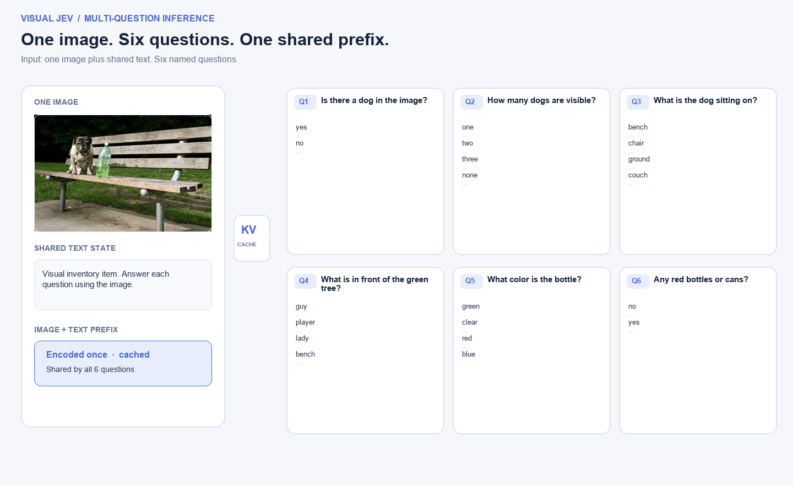
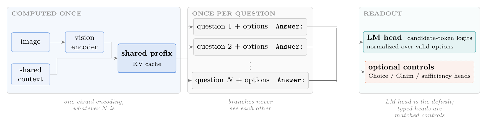
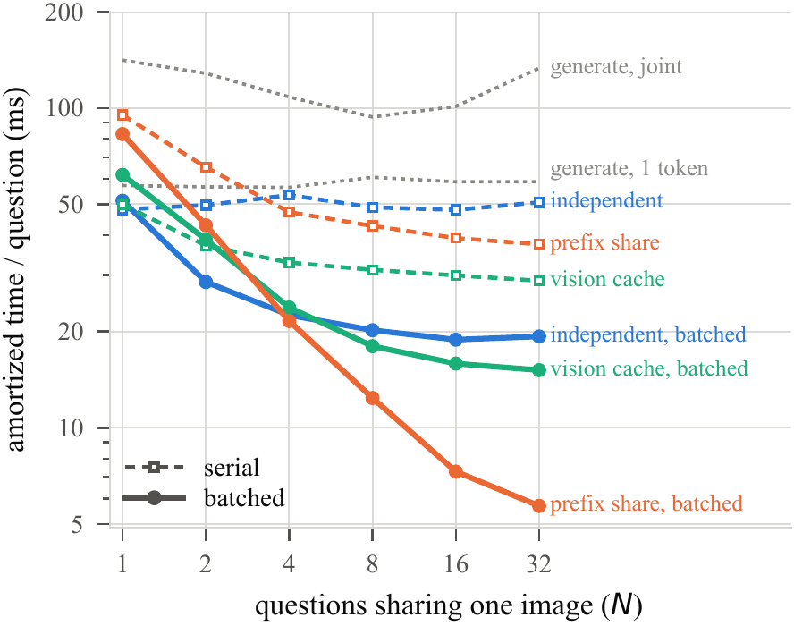
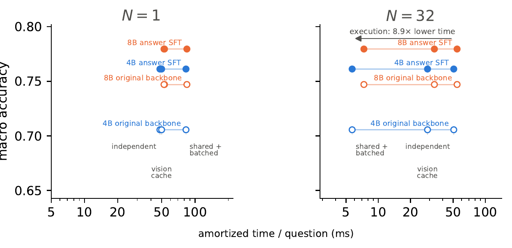

# Visual Jev

**Decision probabilities for many questions about one image.** This is the official code and results repository for [*Visual Jev: Accurate and Efficient Decisions from Shared Visual Context*](https://arxiv.org/abs/2609.25845). The project extends the Jev-style decision interface to vision: each question supplies its answer choices at request time, and each answer is scored independently against the same image and public context.

**[📄 Paper](https://arxiv.org/abs/2609.25845)** · **[🌐 Project page](https://guanxuyu-sv.github.io/Visual-Jev/)** · **[🤗 4B answer-supervised adapter](https://huggingface.co/guanxuyu/visual-jev-4b-answer-sft)** · **[🧪 Reproduction guide](REPRODUCE.md)**

<p align="center">
  
</p>

<p align="center"><sub>One image, six different questions, six independent probability distributions.</sub></p>

<p align="center">
  
</p>

<p align="center"><sub>One visual encoding and cached public prefix; independent question suffixes run as a batch.</sub></p>

The default system uses answer-supervised LoRA on Qwen3-VL-4B. It reads candidate-token logits from the backbone's existing **LM head** at each `Answer:` position and normalizes them over that question's valid choices. The typed heads in the diagram are experimental controls.

## Results at a glance

| Finding | Evidence from the paper |
| --- | --- |
| **Use the existing LM head.** | Answer SFT and a matched typed linear decision head both reach **0.761** four-benchmark macro accuracy. The head has no consistent advantage across three seeds. |
| **Fine-tune for the target task.** | The 4B backbone rises from **0.706 → 0.761** macro accuracy after answer supervision. Most of the gain is on GQA and SNLI-VE, the task families represented in training; held-out TextVQA and TallyQA change little. |
| **Share work across questions.** | With **32 questions per image**, shared-prefix batching reaches **5.7 ms amortized per question**, versus **50.7 ms** for independent serial execution and **19.3 ms** for batching without prefix reuse. |

The **8.9×** comparison is a throughput result: the shared batch of 32 finishes in about **182 ms**. Its 5.7 ms figure is the batch time divided by 32, not the latency of one independently arriving request. At `N = 1`, prefix sharing adds overhead (**82.9 ms** versus **48.1 ms** independent). At `N = 32`, peak allocated memory rises from **8.40 to 10.10 GiB**. The speedup comes from both parallel question execution and reuse of visual context.

This is also how we interpret Jev's speed: parallel decisions over shared context can improve throughput, while batching one question does not make the same model's single request faster. A smaller backbone can lower absolute inference cost. In our matched 32-question shared-batch measurement, **4B takes 5.7 ms/question** and **8B takes 7.3 ms/question**, with macro accuracy of **0.761** and **0.780**, respectively. This model-size comparison is separate from the execution-path gain; we did not measure the latency of another Jev service.

## Figures

### Execution sweep



Warm amortized time per question as more questions share an image. Color identifies the reused computation; solid lines are batched paths and dashed lines are serial paths.

### Accuracy and execution cost



At `N = 1`, prefix sharing adds overhead. At `N = 32`, it moves each backbone left on the cost axis without changing its training state. Hollow and filled markers separate the original backbone from answer SFT; blue and orange separate 4B and 8B.

Timings are synchronized warm measurements on one RTX 5090 in bfloat16. They start from an in-memory decoded image and include preprocessing, transfer, and execution. Image decoding, disk and network I/O, and serving queues are excluded. See the [paper](https://arxiv.org/abs/2609.25845) for the full protocol and limitations.

## Try the released model

This is **inference only**: no training run or benchmark dataset is needed. The script runs on CUDA or Apple Silicon's MPS backend. On a Mac, install a regular macOS PyTorch build (do not use the CUDA wheel command in the reproduction section), then install the project's remaining dependencies:

```bash
python3 -m venv .venv && source .venv/bin/activate
pip install torch torchvision
pip install -r code/requirements.txt
```

Classify a local image among choices you supply; `--device auto` selects MPS on a Mac:

```bash
python code/examples/quickstart.py --image /path/to/image.jpg \
    --question "What animal is in the image?" \
    --choices cat dog bird other --device mps
```

For several questions about the same image, use Jev's named `questions` with a shared `state`. The included request asks about presence, count, objects, spatial relations, and color:

```bash
python code/examples/quickstart.py \
    --image assets/figures/demo_bottle.jpg \
    --request-file code/examples/bottle_questions.json --device mps
```

The shared image and `state` are cached once, then reused by the parallel questions. The demo includes an `incorrect_question` choice for false premises; it catches the dog/person mismatch with 0.966 probability. This runner supports `choice` questions with 2–16 options. It downloads the 4B base and adapter on first use; lower `--max-pixels` if Mac memory is tight.

## Reproduce the paper

Follow the [end-to-end reproduction guide](REPRODUCE.md) for the exact environment, dataset layout, commands, and evaluation settings. The workflow is:

1. Obtain the source datasets and build the question records for GQA, SNLI-VE, TextVQA, and TallyQA.
2. Train the answer-supervised LoRA system and the matched head controls. The published [4B adapter](https://huggingface.co/guanxuyu/visual-jev-4b-answer-sft) contains the recommended system's LoRA weights.
3. Run predictions on the four evaluation sets, score them, and regenerate the paper's tables and figures with `code/reports/`.

The scored outputs in `data/` let you inspect the reported numbers without a GPU. Reproducing the predictions requires the source datasets, backbone weights, and a GPU.

```text
code/vdm/               data building, training, and evaluation
code/examples/          minimal inference example
code/reports/           tables and figure generation
data/                   scored experimental outputs
site/                   website source and build scripts
docs/index.html         generated GitHub Pages site
assets/figures/         README figures and the bottle demo image
REPRODUCE.md           end-to-end reproduction guide
```

The paper covers one backbone family at two sizes, four forced-choice benchmark conversions, and a single-machine timing setup. Its scope and statistical limitations are described in the [manuscript](https://arxiv.org/abs/2609.25845).

## Citation

```bibtex
@misc{yu2026visualjev,
  title        = {Visual Jev: Accurate and Efficient Decisions from Shared Visual Context},
  author       = {Guanxu Yu and Yuhang Yao},
  year         = {2026},
  eprint       = {2609.25845},
  archivePrefix = {arXiv},
  primaryClass = {cs.CV},
  url          = {https://arxiv.org/abs/2609.25845}
}
```

## License

The repository's code and documentation are released under [Apache-2.0](LICENSE). The [LoRA adapter](https://huggingface.co/guanxuyu/visual-jev-4b-answer-sft) is also listed as Apache-2.0 on its model card. The Qwen backbone, source datasets, and paper are distributed under their respective upstream terms.

## Build the project website

The [project website](https://guanxuyu-sv.github.io/Visual-Jev/) presents examples, a latency explorer, and negative results. Its figures are generated from the scored outputs in `data/`:

```bash
python3 site/build_site.py --reports data --demos data/demos.json
```

`docs/index.html` is generated output; edit `site/template.html` to change the website. `site/make_demos.py` builds `data/demos.json` from raw per-example predictions and model input images, which are not stored in this repository.
